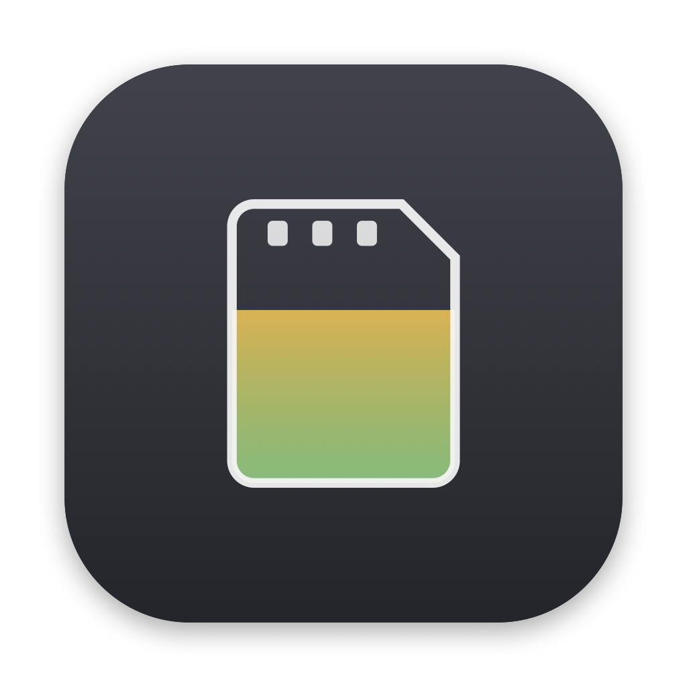
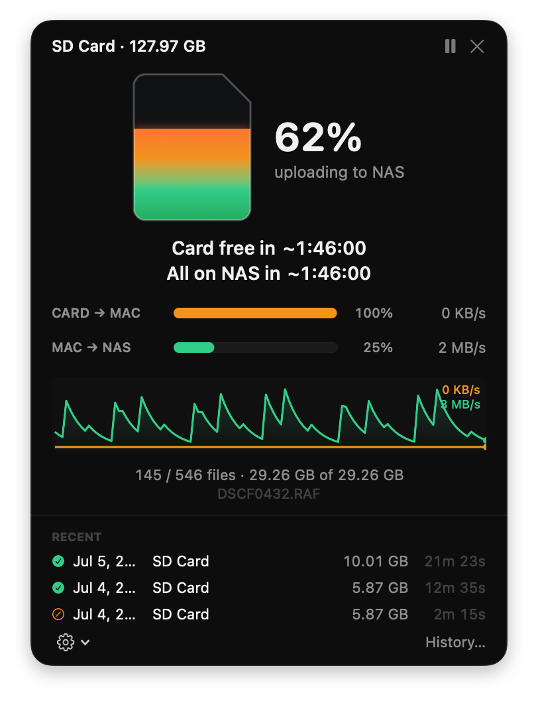
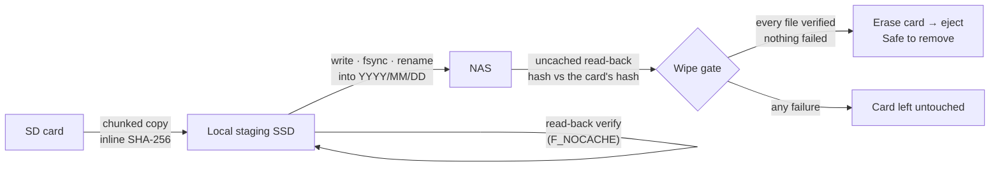
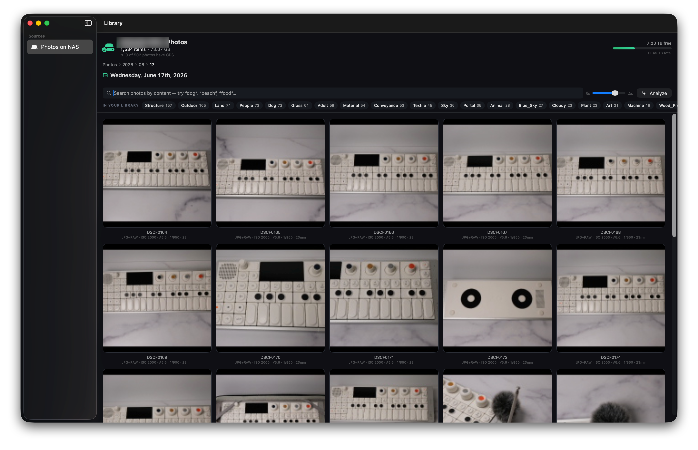

<p align="center">
  
</p>

<h1 align="center">Offload</h1>

<p align="center"><strong>Insert an SD card. Walk away.</strong></p>

<p align="center">
  A macOS menu-bar app that automatically moves photos from an SD card to your NAS —
  <br>fast, cryptographically verified, and erasing the card <em>only</em> when every byte is provably safe.
</p>

<p align="center">
  
  
  
  
  
  
</p>

<p align="center">
  
  <br><sub><em>Mid-offload: card fully read, uploading to the NAS and verifying — live throughput, dual ETAs, and a card that won't be wiped until every file checks out.</em></sub>
</p>

---

## The problem

Every shoot ends the same way: pull the card, drag files to the NAS in Finder, squint at the
progress bar, and then face the worst decision in photography — *is it safe to format the card yet?*
Finder copied the files, but did every byte actually land on the server? Did that one RAW finish?
The honest answer is you don't know, so you either keep the card full "just in case" or you format
it and hope.

**Offload removes the hope.** It copies, verifies each file end-to-end with SHA-256, and wipes the
card only after it has *read the bytes back off the NAS* and confirmed they match what it read off
the card. If a single file can't be verified, the card is left completely untouched.

## How it works

Two pipelined hops with a verify at each, and a strict all-or-nothing wipe gate at the end:



1. **Hop 1 — card → local staging SSD.** Chunked copy with SHA-256 computed *inline on the first
   read* (the card read is the canonical hash), then a read-back verify with `F_NOCACHE` so it
   checks the disk, not the page cache.
2. **Hop 2 — staging → NAS.** Each file is promoted the moment it staging-verifies, so wall-clock ≈
   `max(card read, NAS write)`. Files land in pure date folders (`YYYY/MM/DD/` from EXIF
   *DateTimeOriginal*), then the NAS copy is **read back uncached** and its hash compared to the
   original card-read hash — true end-to-end integrity.
3. **Wipe gate.** The card is erased only when *every* file is NAS-verified, nothing failed, the NAS
   is healthy right now, and each card file re-stats unchanged. Then it unmounts, ejects, and says
   **"Safe to remove."**

**If anything goes wrong, the card survives.** Crash, yanked card, or the NAS dropping off
mid-transfer — a crash-safe JSON journal resumes exactly where it left off. A hash mismatch re-copies
that file once, then fails it; a failed file means the wipe never runs. A per-card session token
means a *different* card that happens to reuse a synthesized volume UUID is never mistaken for the
one being offloaded.

> **Why "uncached" matters.** Over SMB, `fsync` flushes your bytes to the server but doesn't
> invalidate the client read cache — so a normal read-back can re-hash the bytes you just wrote out
> of local memory and "pass" without ever touching the server. Offload's wipe-gating verify is
> always uncached, so a match *proves the server holds the data*. This is the whole ballgame for a
> tool that erases cards.

## Features

**Ingest & safety**
| | |
|---|---|
| Automatic detection | DiskArbitration spots the card; a DCIM heuristic + per-card policy (always / ask / ignore) decides what to do |
| Verified two-hop transfer | Card → staging → NAS, pipelined per file, SHA-256 inline + read-back at both hops |
| End-to-end integrity | NAS copy hashed (uncached) against the original card-read hash before anything is deleted |
| Smart dedup | A photo already on the NAS (proven by hash) is skipped, not re-uploaded; same-name-different-content gets a ` (2)` suffix — nothing is ever silently overwritten |
| All-or-nothing wipe | Strict gate + cancellable countdown, empty-DCIM prune, auto-eject; one unverifiable file blocks the whole wipe |
| Crash / yank resilience | Journaled per-file state machine resumes exactly where it stopped, regardless of policy |

**Library & viewer**
| | |
|---|---|
| Browse NAS + card | Storage gauge, progressive photo count, date-folder navigation |
| Folder collage cards | Date folders render as a photo collage of what's inside, captioned "Saturday, July 4th, 2026" |
| Fast thumbnails | Embedded-preview extraction (KBs over SMB, not whole RAWs), memory + disk cache, bounded concurrency |
| In-app viewer | Opens instantly (no Preview), zoom/pan, arrow-key paging, RAW+JPEG paired into one photo |
| Info inspector | Camera, lens, full exposure, dimensions/megapixels, GPS, and content tags — packed into one panel |
| Delete & multi-select | Remove photos (with their RAW/sidecars) from the NAS, one or many, with confirmation |

**On-device AI & search** — *no cloud, no API keys, no accounts, no telemetry*
| | |
|---|---|
| Content search | Apple Vision (on the Neural Engine) tags scenes/objects/animals so you can search "beach", "dog", "food" |
| Location | EXIF GPS extraction + library coverage; reverse-geocoding to place names is a planned opt-in |
| Named faces & pets | *In progress* — a suggest-and-confirm flow to name people ("Elizabeth") and pets ("Hurley") that learns from your labels |

## Use cases

- **Home from a shoot.** Drop the card in, close the lid on your worries. Come back to every frame on
  the NAS, sorted by the day it was taken, verified, and a card that's already wiped and ready for
  tomorrow.
- **A long day across many cards.** Offload each in turn. Re-insert a card you only half-emptied and
  dedup means it picks up exactly the frames that aren't safe yet — no duplicates, no re-copying.
- **The format-anxiety cure.** You never have to guess whether a copy "really" finished. If the card
  got wiped, the bytes are provably on the NAS. If anything was off, the card is still full.
- **RAW + JPEG shooters.** A paired shot shows as one tile; the JPEG opens instantly for review, the
  RAW rides along and deletes with it.
- **Finding that photo months later.** Search your whole archive by what's *in* the frame, entirely
  on-device — and soon by *who* is in it.
- **NAS housekeeping.** Cull and delete straight from the Library without ever launching Finder or
  Preview.

## Screenshots

The menu-bar popover is up top. Two more views round it out — drop `library.png`
and `viewer.png` into [`docs/screenshots/`](docs/screenshots) and add:

```md


```

## Build & run

Requires **macOS 14+ on Apple Silicon** and a Swift 6 toolchain (Xcode 16+). Zero external
dependencies.

```bash
# Dev run (menu-bar app; no Dock icon)
swift run OffloadApp

# Build a signed .app bundle → build/Offload.app
bash Scripts/build-app.sh
open build/Offload.app

# Tests
swift test

# Prove the wipe path end-to-end on a fake card + NAS (no hardware, no real card ever touched)
bash Scripts/harness.sh
```

The integration harness drives a **real** session against a temporary fake card and a local
stand-in NAS, asserting the safety property in every failure mode: happy path, NAS drops out
mid-upload, one file fails (wipe blocked), crash-and-resume, and a wrong card on a colliding UUID
(not wiped).

## Configuration

Everything is in **Settings** (from the popover's gear menu):

- **Destination** — the mounted NAS path (default `/Volumes/Photos`; the share name is yours to set).
- **Ingest scope** — DCIM-only (default) or the whole card; remembered per-card policy.
- **Wipe policy** — after NAS-verify (default), after staging-verify, or ask each time; auto-eject toggle.
- **Staging** — location and purge policy (purge on verify by default; keep-N-days optional).
- **Performance** — parallel NAS uploads (verification is always uncached, regardless).
- **General** — notifications, completion sound, launch at login.

## Under the hood

| | |
|---|---|
| Language / build | Swift 6, Swift Package Manager, **no `.xcodeproj`**, ad-hoc codesigned |
| Concurrency | Swift actors throughout (journal, NAS locator, staging budget, pipeline queues) |
| Integrity | CryptoKit SHA-256 (ARMv8 SHA-2 instructions — never the bottleneck) |
| IO | Raw-fd chunked copy/hash, `F_NOCACHE` / `F_PREALLOCATE` / `fsync` where they belong |
| Detection & mounts | DiskArbitration (card), NetFS + statfs ghost-mount guard (NAS) |
| Imaging & AI | ImageIO (thumbnails, EXIF, RAW), Vision on the Neural Engine (content + faces) |
| App | SwiftUI `MenuBarExtra`, Swift Charts sparkline, `SMAppService` login item |
| Tests | 73 unit tests + a full wipe-path integration harness |

## Status

A personal tool, built to a high bar and shared so others can read it, learn from it, or build it
themselves. It is **not** on the App Store and is ad-hoc signed — you build it yourself (first launch
will ask for Removable Volumes and Network Volumes permission). It intentionally has **no** reader
accounts, telemetry, or cloud services; all AI runs on-device.

## Roadmap

- Named faces & pets (suggest-and-confirm; a bundled Core ML face model for higher accuracy later)
- Opt-in reverse-geocoding of GPS to place names ("Fairhope, Alabama")
- Decoupled NAS-verify workers to reclaim upload throughput after the always-uncached verify
