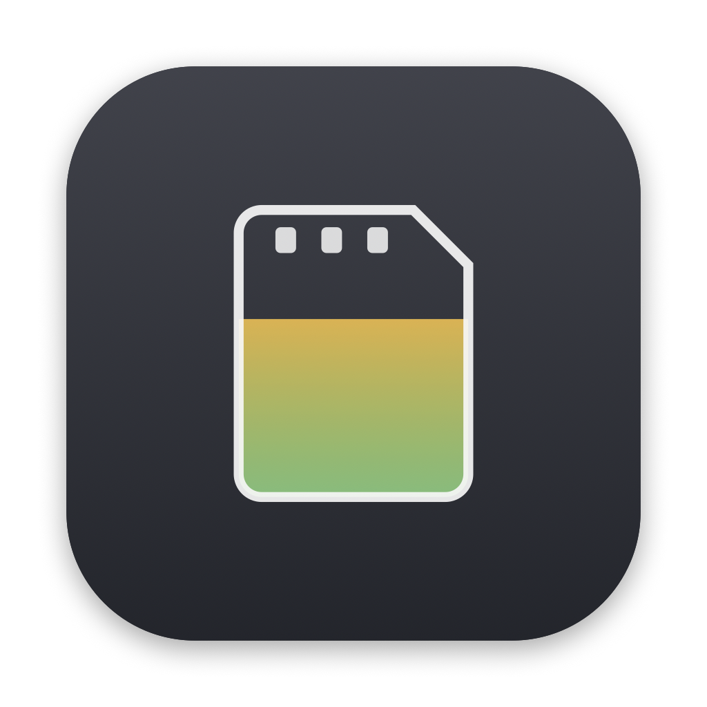
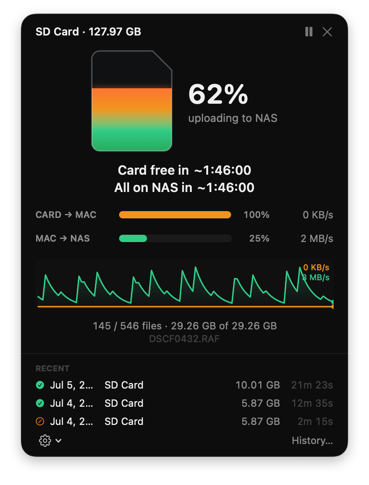
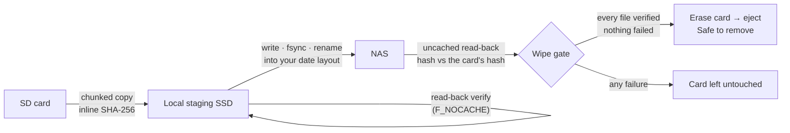
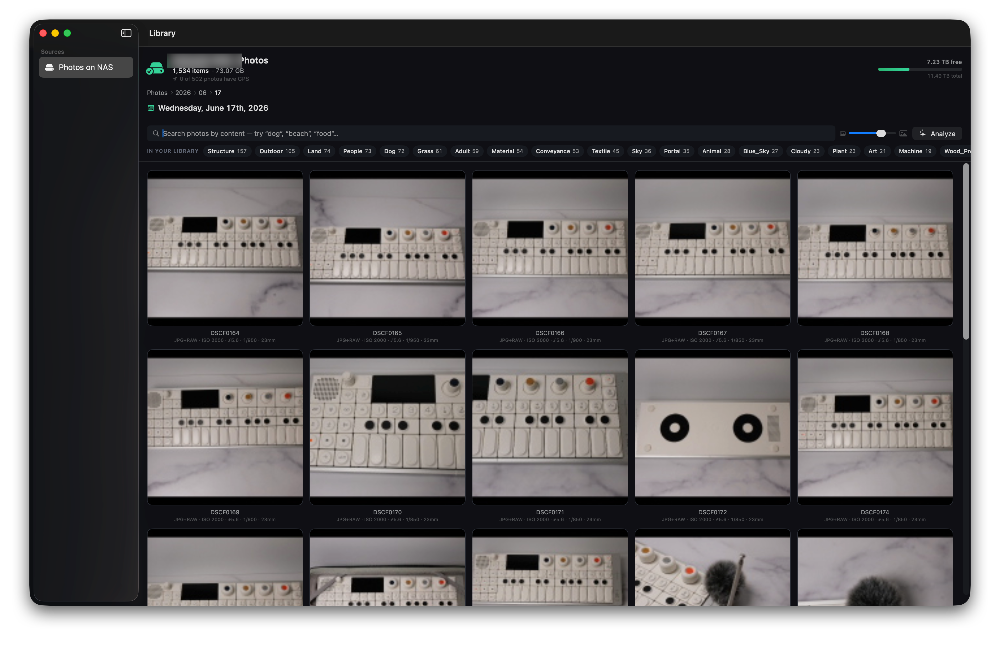

<p align="center">
  
</p>

<h1 align="center">SD Offload</h1>

<p align="center"><strong>Insert an SD card. Walk away.</strong></p>

<p align="center">
  A macOS menu-bar app that automatically moves photos from an SD card to your NAS —
  <br>fast, cryptographically verified, and erasing the card <em>only</em> when every byte is provably safe.
</p>

<p align="center">
  
  
  
  
  
  
</p>

<p align="center">
  
  <br><sub><em>Mid-offload: card fully read, uploading to the NAS and verifying — live throughput, dual ETAs, and a card that won't be wiped until every file checks out.</em></sub>
</p>

---

## The problem

Every shoot ends the same way: pull the card, drag files to the NAS in Finder, squint at the
progress bar, and then face the worst decision in photography — *is it safe to format the card yet?*
Finder copied the files, but did every byte actually land on the server? Did that one RAW finish?
The honest answer is you don't know, so you either keep the card full "just in case" or you format
it and hope.

**SD Offload verifies the transfer.** It copies, verifies each file end-to-end with SHA-256, and wipes the
card only after it has *read the bytes back off the NAS* and confirmed they match what it read off
the card. If a single file can't be verified, the card is left completely untouched.

## How it works

Two pipelined hops with a verify at each, and a strict all-or-nothing wipe gate at the end:


```mermaid
flowchart LR
    SD["SD card"] -->|"chunked copy<br/>inline SHA-256"| STG["Local staging SSD"]
    STG -->|"read-back verify<br/>(F_NOCACHE)"| STG
    STG -->|"write · fsync · rename<br/>into your date layout"| NAS["NAS"]
    NAS -->|"uncached read-back<br/>hash vs the card's hash"| GATE{"Wipe gate"}
    GATE -->|"every file verified<br/>nothing failed"| WIPE["Erase card → eject<br/>Safe to remove"]
    GATE -->|"any failure"| KEEP["Card left untouched"]
```

1. **Hop 1 — card → local staging SSD.** Chunked copy with SHA-256 computed *inline on the first
   read* (the card read is the canonical hash), then a read-back verify with `F_NOCACHE` so it
   checks the disk, not the page cache.
2. **Hop 2 — staging → NAS.** Each file is promoted the moment it staging-verifies, so wall-clock ≈
   `max(card read, NAS write)`. Files land in your selected reversible date-folder layout (using EXIF
   *DateTimeOriginal*), then the NAS copy is **read back uncached** and its hash compared to the
   original card-read hash — true end-to-end integrity.
3. **Wipe gate.** Each source is exclusively claimed and checked again (identity, metadata, and SHA-256) before deletion; changed files are restored and erasure stops. Interrupted claims can be restored on retry. Before erasure, reread the entire NAS batch and any configured second copy
   and compare SHA-256 hashes again. Missing or changed destinations block erasure; the gate also
   checks source identity and NAS health.
4. **Recovery copies.** Keep local staging after completion, cancellation, and app restart.
   The next new transfer may remove completed batches only after fresh NAS verification.
   Failed or unverifiable batches remain; longer retention settings still apply.

**Interrupted transfers retain journal state.** Crash, yanked card, or the NAS dropping off
mid-transfer — a crash-safe JSON journal resumes exactly where it left off. A hash mismatch re-copies
that file once, then fails it; a failed file means the wipe never runs. A per-card session token
means a *different* card that happens to reuse a synthesized volume UUID is never mistaken for the
one being offloaded.

> **Why "uncached" matters.** Over SMB, `fsync` flushes your bytes to the server but doesn't
> invalidate the client read cache — so a normal read-back can re-hash the bytes you just wrote out
> of local memory and "pass" without ever touching the server. SD Offload's wipe-gating verify is
> always uncached. A matching read-back records integrity at that time; it cannot guarantee
> against later deletion, storage failure, or changes by another process. Retained local copies
> provide an additional recovery opportunity.

## Features

**Ingest & safety**

| | |
|---|---|
| Automatic detection | DiskArbitration spots camera cards; one global insert action controls whether SD Offload starts, asks, or does nothing |
| Multiple-card queue | Insert several cards and they wait in a FIFO queue, then offload one at a time without competing for the NAS |
| Verified two-hop transfer | Card → staging → NAS, pipelined per file, SHA-256 inline + read-back at both hops |
| Optional second verified copy | Require every photo to verify on both the NAS and a second destination before the card can be erased |
| End-to-end integrity | NAS copy hashed (uncached) against the original card-read hash before anything is deleted |
| Smart dedup | A photo already on the NAS (proven by hash) is skipped, not re-uploaded; same-name-different-content gets a ` (2)` suffix — nothing is ever silently overwritten |
| All-or-nothing wipe | Strict gate + cancellable countdown, empty-DCIM prune, auto-eject; one unverifiable file blocks the whole wipe |
| Crash / yank / outage resilience | Journaled per-file state resumes interrupted work; an unavailable NAS is retried and the transfer continues when the expected share returns |

**Library & viewer**

| | |
|---|---|
| Browse NAS + card | Storage gauge, progressive photo count, date-folder navigation |
| Flexible date folders | Seven presets or a reversible custom pattern; safely convert existing folders with preflight, resume, and rollback |
| Folder collage cards | Date folders render as a photo collage of what's inside, captioned "Saturday, July 4th, 2026" |
| Fast thumbnails | Embedded-preview extraction (KBs over SMB, not whole RAWs), memory + disk cache, bounded concurrency |
| In-app viewer | Opens in the app (no Preview), honors portrait orientation, offers non-destructive rotate/zoom/pan, arrow-key paging, explanatory hover labels, and pairs RAW+JPEG as one photo |
| Info inspector | Camera, lens, full exposure, dimensions/megapixels, GPS, and content tags — packed into one panel |
| Culling workflow | Rate 0–5, mark Pick or Reject, filter the grid, auto-advance in the viewer, and delete rejected photos when ready |
| Finder access | Visible Show in Finder for selected files and viewer photos; Open Folder in Finder for the current folder |
| Organize & delete | Favorites timeline, pinned folders, multi-select, and confirmed deletion of photos with their RAW/sidecars |

**AI, faces & search**

| | |
|---|---|
| Optional photo identification | Run on demand through your logged-in Codex or Claude Code session, or your own Anthropic API key to save a description and searchable tags |
| Editable photo tags | Add, rename, or remove tags in the viewer’s Info panel; saved locally, searchable, and preserved through later AI analysis |
| Library search | Search saved descriptions and tags, filenames, and assigned people/pet names across the archive |
| Named faces & pets | Opt-in, on-device detection and embeddings with a suggest-and-confirm flow; names and decisions stay local |
| Location metadata | View embedded EXIF GPS coordinates in the info inspector and open them in Maps |

## Use cases

- **Home from a shoot.** Drop the card in, close the lid on your worries. Come back to every frame on
  the NAS, sorted by the day it was taken, verified, and a card that's already wiped and ready for
  tomorrow.
- **A long day across many cards.** Offload each in turn. Re-insert a card you only half-emptied and
  dedup means it picks up exactly the frames that aren't safe yet — no duplicates, no re-copying.
- **Review transfer results.** History lists each filename, destination, recorded outcome,
  and source hash. Historical verification does not claim that a file still exists today.
- **RAW + JPEG shooters.** A paired shot shows as one tile; the JPEG opens instantly for review, the
  RAW rides along and deletes with it.
- **Finding that photo months later.** Search saved AI descriptions and tags, filenames, or the
  people and pets you've named.
- **NAS housekeeping.** Rate, pick, reject, favorite, and delete straight from the Library without
  ever launching Finder or Preview.

## Screenshots

The menu-bar popover is up top. Here's the **Library** — searchable photo tags and
per-photo EXIF under each frame:



## Install

**Download the app** — grab the latest `.dmg` from
[**Releases**](https://github.com/t0nyz0/SD-Offload/releases), open it, and drag
**SD Offload.app** to `/Applications`. A `.zip` is published there too if you prefer it.

It's ad-hoc signed (not yet notarized — see [Status](#status)), so macOS quarantines a
downloaded copy. Clear it once and launch:

```bash
xattr -dr com.apple.quarantine "/Applications/SD Offload.app"
open "/Applications/SD Offload.app"
```

(Or right-click the app → **Open**; if macOS still refuses, System Settings →
Privacy & Security → **Open Anyway**.) First launch asks for Removable Volumes +
Network Volumes permission. It lives in the menu bar; a Dock icon appears while one of its windows
is open.

Prefer to read the code before trusting it with a card? **Build from source** below.

## Build & run

Requires **macOS 14+ on Apple Silicon** and a Swift 6 toolchain (Xcode 16+). Zero external
dependencies.

```bash
# Dev run (menu-bar app)
swift run OffloadApp

# Build a signed .app bundle → build/SD Offload.app
bash Scripts/build-app.sh
open "build/SD Offload.app"

# Tests
swift test

# Prove the wipe path end-to-end on a fake card + NAS (no hardware, no real card ever touched)
bash Scripts/harness.sh
```

The integration harness drives **real** sessions against a temporary fake card and local stand-in
destinations. Its ten modes cover the happy path, NAS and file failures, crash-and-resume, a wrong
card on a colliding UUID, a required second verified copy, second-destination failure, and resuming
to backfill a missing second copy before wiping, plus missing/corrupted destinations at the final erasure check.

GitHub CI runs the unit tests and all ten integration modes on every push to `main` and every
pull request. Regression tests cover SMB-safe exclusive creation, preserving existing files,
corrupt-copy detection, stalled verification, and retry progress that must not claim completion.
They also cover bounded recovery of stuck card probes, mount identity changes, large sequential
verification reads, and NAS flush-wait status.
Recovery also respects Ask and Ignore for unfinished sessions; POSIX errors retain their operation and code.
To require an actual disposable exFAT image instead of accepting a local-directory fallback, run
`OFFLOAD_REQUIRE_EXFAT=1 swift run offload-harness run`. A failure to create the image is a failed
compatibility check, not a passing wipe test. The observed physical-card erasure failure is still
undiagnosed; version 1.7.16 improves its diagnostics without changing the deletion algorithm.

CI uses disposable local fixtures; actual SMB server compatibility is checked separately with
the NAS probes described below.

## Configuration

Everything is in **Settings** (from the popover's gear menu):

- **General** — launch at login, tray/Library behavior, completion sound, and app version.
- **Destination** — primary NAS folder, seven date-folder presets or a custom reversible pattern,
  safe conversion of existing date folders, and an optional second verified destination.
- **Card & Offload** — one global insert action, camera-folders-only or whole-card ingest, wipe and
  eject policy, staging retention, parallel uploads, and optional NAS warm-up on insertion.
- **Library** — thumbnail quality and optional photo analysis through Codex, Claude Code, or Anthropic API.
- **Notifications** — separate controls for card detection, successful completion, and problems.

### AI setup and photo tags

In **Settings → Library → AI photo analysis**, select **Claude**, **Codex**, or **Anthropic API**.
For Claude Code or Codex, install the current CLI and sign in from Terminal (`claude` or
`codex login`). The app uses that account’s usage limits; a ChatGPT or Claude desktop app alone
is not a substitute for the CLI. For Anthropic API, enter your API key and optionally a model.
Provider changes apply to the next analysis; a running batch keeps its original provider.

Open a photo’s **Info** panel and choose **Edit Tags…** to add, rename, or remove tags.
Edits update search and stay intact after later AI analysis. Tags are stored in SD Offload’s
local index; they are not embedded into the original image or its sidecars.

**Balanced** thumbnail quality is the default for responsive browsing. Higher quality reads
more image data and uses more network bandwidth and memory. Existing preferences are preserved.
See the [QA report](docs/QA-2026-09-26.md) for measured local performance and remaining validation;
local SSD benchmarks are not SD-card or SMB throughput promises.

### Release files

`bash Scripts/release.sh` builds the release app and creates versioned `.dmg` and `.zip`
files in `build/`. GitHub releases also include `SHA256SUMS.txt`; verify downloaded files with
`shasum -a 256 -c SHA256SUMS.txt` from the download folder. Builds are for Apple Silicon,
ad-hoc signed, and not notarized.

## Under the hood

| | |
|---|---|
| Language / build | Swift 6, Swift Package Manager, **no `.xcodeproj`**, ad-hoc codesigned |
| Concurrency | Swift actors throughout (journal, NAS locator, staging budget, pipeline queues) |
| Integrity | CryptoKit SHA-256 with ARMv8 SHA-2 acceleration |
| IO | Raw-fd chunked copy/hash, `F_NOCACHE` / `F_PREALLOCATE` / `fsync` where they belong |
| Detection & mounts | DiskArbitration (card), NetFS + statfs ghost-mount guard (NAS) |
| Imaging & AI | ImageIO (thumbnails, EXIF, RAW), Vision (local faces/pets), optional Codex / Claude Code CLI or Anthropic API (photo identification) |
| App | AppKit status item and popover, SwiftUI windows, Swift Charts sparkline, `SMAppService` login item |
| Tests | 158 automated tests (plus an opt-in live CLI test) + ten full wipe-path integration harness modes |

## Status

A personal tool, built to a high bar and shared so others can read it, learn from it, or build it
themselves. It is **not** on the App Store and release builds are ad-hoc signed rather than notarized.
Prebuilt `.dmg` and `.zip` downloads are published on GitHub, or you can build it yourself. First
launch asks for Removable Volumes and Network Volumes permission.

SD Offload has no app account or telemetry. Transfers, browsing, EXIF handling, face/pet detection,
and face labels stay local. Photo identification is optional: when you invoke it, the selected image
is sent to your selected provider through your Codex or Claude Code session, or through Anthropic's API using your own key;
the API key is stored in the macOS Keychain.

**Security posture:** no App Sandbox (it needs full access to removable + network volumes), no
hardened runtime, no notarization — so build it from source and inspect the destructive path
yourself ([`WipeGate.swift`](Sources/OffloadEngine/WipeGate.swift)). NAS credentials saved by the app
live in the login Keychain, device-only (never synced).

**Independent and open-source** — unaffiliated with Pomfort's "Offload Manager", [offload.app](https://offload.app/),
or other similarly-named tools.

> ⚠️ **Disclaimer.** SD Offload can erase removable media. It is provided **as-is, with no warranty**
> — you are responsible for your data and your configuration. The safe-wipe gate is designed to be
> strict and fail-closed, but verify your NAS destination and test on a non-critical card before you
> trust it with a real shoot. The author is not liable for any data loss. (Auto-wipe runs only after
> end-to-end verification and can be set to "ask each time" in Settings.)

## Roadmap

- Decoupled NAS-verify workers to reclaim upload throughput after the always-uncached verify

## License

[MIT](LICENSE) © [t0nyz0](https://github.com/t0nyz0). Zero third-party dependencies — only Apple
system frameworks, so there are no bundled licenses to track.

### September 2026 audit fixes

Version 1.7.13 addresses the [code audit findings](docs/qa-2026-09-28/REPORT.md): backup collisions, changed-source erasure, incomplete face scans, failed/out-of-order metadata saves, description search, cancellation, and low-space recovery. Library save failures show a **Retry Save** action; favorites, ratings, and pinned-folder snapshots also retry automatically. Conflicting secondary backups are preserved and block erasure until resolved.

The regression suite includes a 100,000-record synthetic performance check. These local measurements and temporary-directory transfer tests do not replace physical SD-card and SMB validation. Version 1.7.14 uses exclusive file creation on network filesystems, including SMB shares that do not support exclusive rename. Local supported filesystems retain atomic partial-file promotion. A network filename can be visible while copying; only a successful complete hash read-back makes it verified. A process crash may leave an unfinished network copy, which a retry preserves and bypasses with a collision-safe name. The final source hash check adds one card read before erasure.

### NAS verification visibility and compatibility

Version 1.7.14 fixes the 1.7.13 exclusive-rename incompatibility observed on SMB. The transfer UI distinguishes saving files from checking them, shows verification read speed and byte/file progress, and keeps reporting through the final safety check. Full copy progress alone is never presented as a finished transfer. An active read without reported bytes for ten seconds displays a waiting message; this is a stall indicator, not proof of a disconnected NAS.

Version 1.7.15 restores 16 MiB sequential verification reads and reports slow NAS metadata,
file-open, and flush operations separately. Card detection uses cached kernel mount information,
rechecks after wake, and permits one bounded replacement for a stuck card probe. See the
[performance and detection checks](docs/qa-2026-10-03/PERFORMANCE.md). Slow server responses can
still limit transfer speed; the app retains full uncached verification and durable flushes.

For an explicitly selected, mounted SMB test share, these optional checks create and remove only uniquely named disposable fixtures:

```bash
swift run offload-harness nas-probe /Volumes/Photos
swift run offload-harness smb-run /Volumes/Photos
```

The first checks exclusive creation, collision protection, and uncached SHA-256 verification. The second runs the full offload pipeline with a generated fake card and an isolated folder on that share. Never substitute a real card for the generated fixture.
